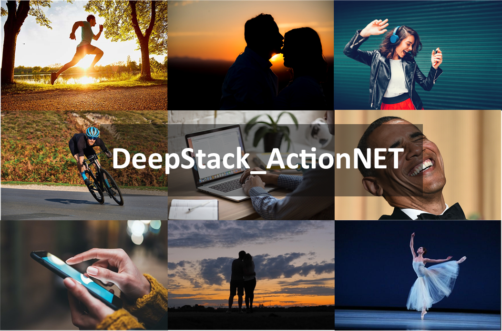
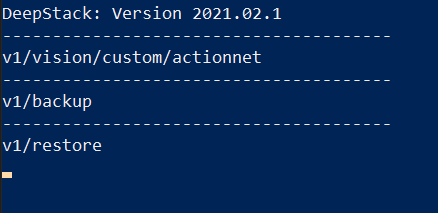

# DeepStack_ActionNET

This repository provides a custom DeepStack model that has been trained and can be used for creating a new `object detection API` for detecting **16 human actions** present in the [ActionNET Dataset](https://github.com/OlafenwaMoses/Action-Net) dataset. Also included in this repository is that dataset with the **YOLO annotations**.

[>> Watch Video Demo](https://www.youtube.com/watch?v=T3wZwLVB0iQ)

- **Download DeepStack Model and Dataset**
- **Create API and Detect Objects**
- **Discover more Custom Models**
- **Train your own Model**




# Download DeepStack Model and Dataset

You can download the pre-trained **DeepStack_ActionNET** model and the annotated dataset via the links below.

- [YOLOv5x DeepStack Model](https://github.com/OlafenwaMoses/DeepStack_ActionNET/releases/tag/v1)
- [ActionNET with YOLO annotation](https://deepquest.sfo2.digitaloceanspaces.com/deepstack/zeus/actionnet_yolo.zip)


# Create API and Detect Actions

The Trained Model can detect the following actions in images and videos. 

- calling
- clapping
- cycling
- dancing
- drinking
- eating
- fighting
- hugging
- kissing
- laughing
- listening-to-music
- running
- sitting
- sleeping
- texting
- using-laptop

To start detecting, follow the steps below

- **Install DeepStack:** Install DeepStack AI Server with instructions on DeepStack's documentation via [https://docs.deepstack.cc](https://docs.deepstack.cc/index.html#installation)
- **Download Custom Model:** Download the trained custom model `actionnet.pt` from [this GitHub release](https://github.com/OlafenwaMoses/DeepStack_ActionNET/releases/tag/v1). Create a folder on your machine and move the downloaded model to this folder.

    E.g A path on Windows Machine `C\Users\MyUser\Documents\DeepStack-Models`, which will make your model file path `C\Users\MyUser\Documents\DeepStack-Models\actionnet.pt`

- **Run DeepStack:** To run DeepStack AI Server with the custom ActionNET model, run the command that applies to your machine as detailed on DeepStack's documentation [linked here](https://docs.deepstack.cc/custom-models/deployment/index.html#starting-deepstack).

    E.g

    For a Windows version, you run the command below
    ```bash
    deepstack --MODELSTORE-DETECTION "C\Users\MyUser\Documents\DeepStack-Models" --PORT 80
    ```

    For a Linux machine
    ```bash
    sudo docker run -v /home/MyUser/Documents/DeepStack-Models -p 80:5000 deepquestai/deepstack
    ```
    Once DeepStack runs, you will see a log like the one below in your `Terminal/Console`

    

    That means DeepStack is running your custom `actionnet.pt` model and now ready to start detecting actions images via the API endpoint `http://localhost:80/v1/vision/custom/actionnet` or `http://your_machine_ip:80/v1/vision/custom/actionnet`

- **Detect actions in image:** You can detect objects in an image by sending a `POST` request to the url mentioned above with the paramater `image` set to an `image` using any proggramming language or with a tool like POSTMAN. For the purpose of this repository, we have provided a sample Python code below.

    - A sample image can be found in `images/test.jpg` of this repository


    

    - Install Python and install the **DeepStack Python SDK** via the command below
        ```bash
        pip install deepstack_sdk
        ```
    - Run the Python file `detect.py` in this repository.

        ```bash
        python detect.py
        ```
    - After the code runs, you will find a new image in `images/test_detected.jpg` with the detection visualized, with the following results printed in the Terminal/Console.

        ```
        Name: dancing
        Confidence: 0.91482425
        x_min: 270
        x_max: 516
        y_min: 18
        y_max: 480
        -----------------------
        ```

    
    - You can try running action detection for other images.

# Discover more Custom Models

For more custom DeepStack models that has been trained and ready to use, visit the Custom Models sample page on DeepStack's documentation [https://docs.deepstack.cc/custom-models-samples/](https://docs.deepstack.cc/custom-models-samples/) .


# Train your own Model

If you will like to train a custom model yourself, follow the instructions below.

- **Prepare and Annotate:** Collect images on and annotate object(s) you plan to detect as [ detailed here ](https://docs.deepstack.cc/custom-models/datasetprep/index.html)
- **Train your Model:** Train the model as [detailed here](https://docs.deepstack.cc/custom-models/training/index.html)